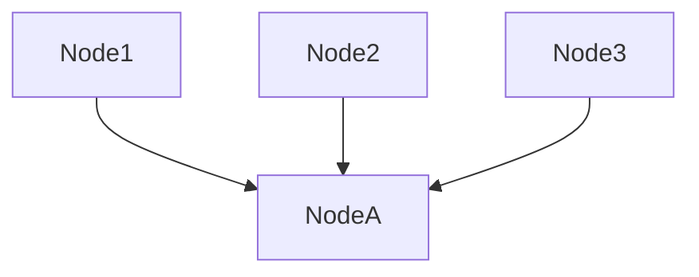
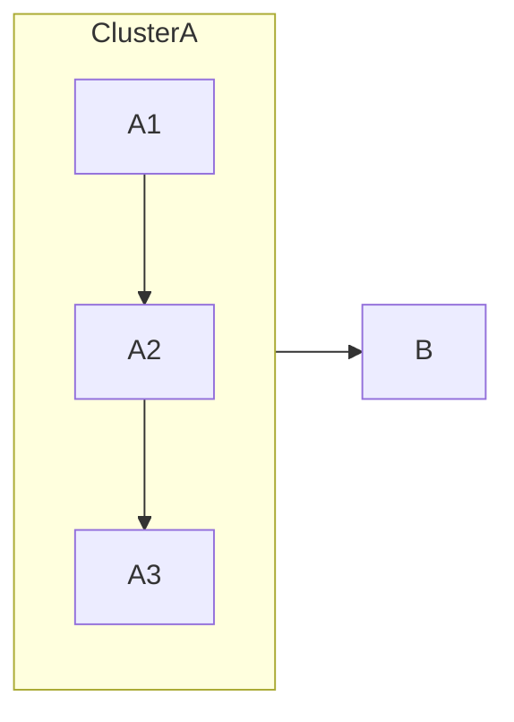
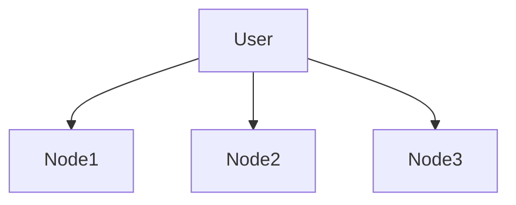

# Layout Mermaid Diagram

## Overview

Techniques to control Mermaid diagram layout without manual positioning. These "physics engine" hacks replace manual dragging by telling the layout engine exactly how to arrange nodes.

## Core Techniques

### 1. Invisible Anchor (~~~)

Keeps nodes on the same rank (horizontal or vertical) without drawing a line.

```mermaid
graph TD
  A --> B
  A --> C
  B ~~~ C  % Forces B and C to stay side-by-side
```

**Use case:** Prevent the engine from stacking nodes that should be side-by-side.

### 2. Arrow Length Hack (----)

Pushes nodes further apart by adding extra dashes to arrows.

```mermaid
graph LR
  A --> B       % Standard distance
  B ---> C      % Double distance
  C ----> D     % Triple distance
```

**Use case:** Clear clutter by lengthening the main spine of the chart.

### 3. Node Definition Ordering

Mermaid reads top-to-bottom. Define your horizontal "row" first to set priority.



**Use case:** Control which nodes get priority in the layout.

### 4. Subgraph Force Fields

Subgraphs act as containers that the layout engine treats as a single block.



**Use case:** Group related nodes and prevent external lines from weaving through them.

### 5. Multi-Node Connections

Connect one node to multiple others in a single line to force them to the same rank.



**Use case:** Force Node1, 2, and 3 to align on the same level, preventing staggering.

## Quick Reference

| Goal | Syntax | Effect |
|------|--------|--------|
| Align Nodes | `A ~~~ B` | Keeps them on same level |
| Push Nodes Away | `A ----> B` | Adds whitespace between levels |
| Keep Grouped | `subgraph ... end` | Forces items to stay together |
| Flip Axis | `graph LR` vs `graph TD` | Changes entire flow direction |

## Common Mistakes

- **Forgetting definition order matters** - Place important nodes first
- **Overusing invisible anchors** - Too many breaks layout entirely
- **Not using subgraphs for grouping** - External lines disrupt logical groups

## When NOT to Use

- Simple diagrams that render correctly automatically
- When you need precise pixel positioning (use a different tool)
